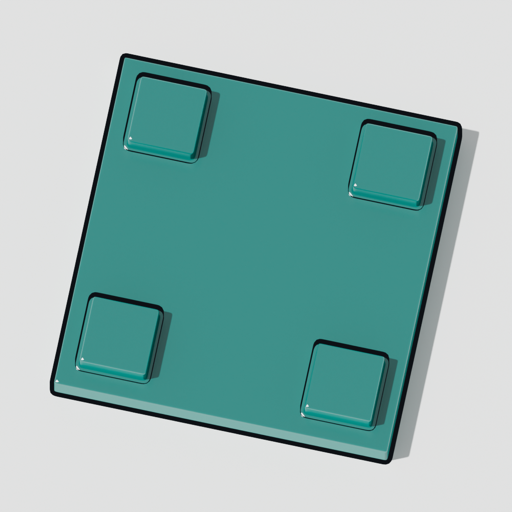

<!-- brand:logo -->


# platform

<!-- catalog:header — generated by `pub catalog render`; do not edit by hand -->
**Ring:** platform · **Layers:** L4 · **Wave:** 1 · **Tier:** incubating

Foundational crates every repo uses: errors, config layering, tracing facade, paths, i18n (fluent), settings schema, diagnostics bundle.

Planned components: pub-platform-config · -log · -i18n · -paths · -settings · -diagnose · -secrets-client
<!-- catalog:end -->

## In 30 seconds

```rust
use pub_platform_paths::{AppId, BaseDirs, Env, Platform};

let dirs = BaseDirs::resolve(Platform::current(), &Env::from_process())?;
let app = dirs.for_app(&AppId::new("docs-aggregate")?);
println!("{}", app.config_dir.display()); // ~/.config/public-software/docs-aggregate on Linux
```

## What it does

- `pub-platform-paths`: the base directories of the XDG Base Directory Specification (configuration, data,
  state, cache, runtime, the two search lists) resolved for Linux, macOS and Windows from an explicit
  environment map, with the native folders as defaults and an `XDG_*` variable winning on every platform
  (ADR-0001); the suite's directory per component under them. No dependency, no ambient reads, no disk access.

## What it does not do (yet)

- Create a directory, or fall back when there is no runtime directory: `runtime_dir` is `None` and the caller
  decides, as the specification asks.
- Configuration layering, logging, i18n, the settings schema, the diagnostics bundle and the secrets client:
  the other six planned crates.

## Status

| Ledger entry | Readiness | Next |
|---|---|---|
| paths (`pub-platform-paths`) | partial: the three tables, the suite layout, the search order | `pub-platform-config` reads its layers through `AppDirs::config_search()` |

## How it fits the suite

Implements: _none yet_ · Requires: _none yet_ (see `CATALOG.toml`)

## Contributing

`pub check` must pass. See the org-wide [CONTRIBUTING](https://github.com/public-software/.github/blob/main/CONTRIBUTING.md) and `PROVENANCE.md`.

## Provenance

See `PROVENANCE.md`.
